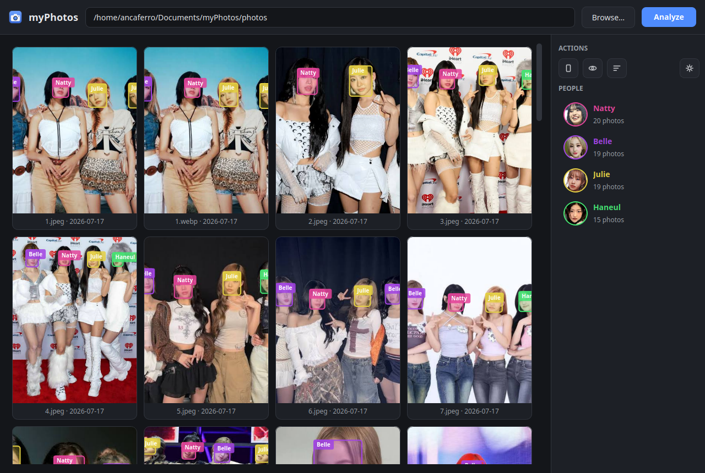
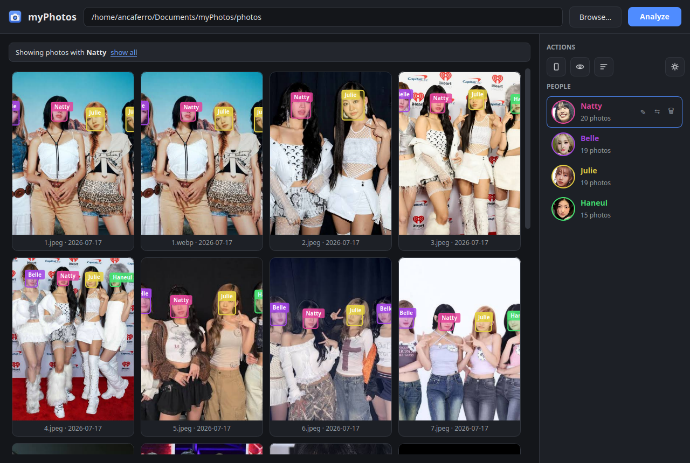
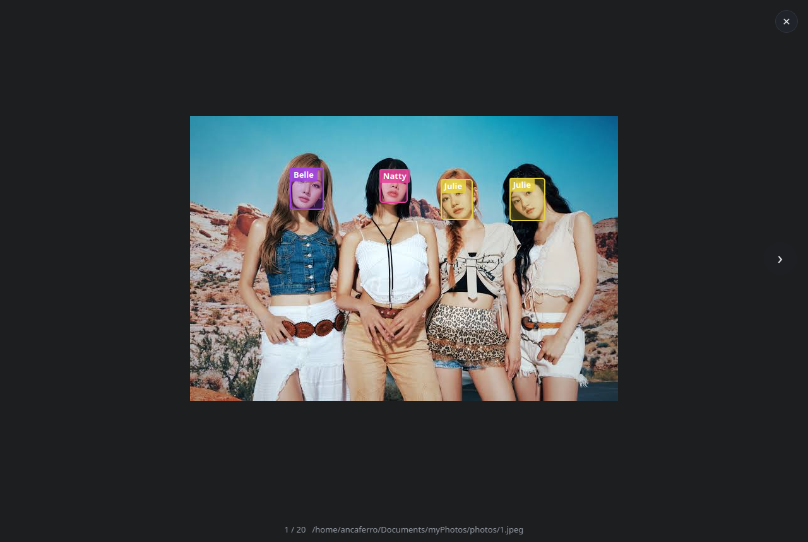

# myPhotos

A desktop app (PySide6) that scans a folder (recursively) for photos, detects
faces with OpenCV, groups identical faces into persons and lets you browse and
filter the photo library by person.

## Screenshots

Gallery with per-person colored face boxes and the people sidebar:



Gallery filtered to one person (rename / merge / delete buttons on the selected
row):



Full-size view of a photo with every detected face outlined and named:



## Download

Prebuilt standalone executables are attached to every
[release](../../releases/latest):

| OS      | File                 |
|---------|----------------------|
| Windows | `myPhotos-Windows.exe`|
| Linux   | `myPhotos-Linux`      |
| macOS   | `myPhotos-macOS`      |

Run the file — the app window opens directly. On Linux/macOS make it
executable first: `chmod +x myPhotos-Linux && ./myPhotos-Linux`. On macOS you
may need to allow it in *System Settings → Privacy & Security* (the binary is
not notarized).

## Features

- Pick any folder; images are discovered recursively (jpg, jpeg, png, webp, bmp, tiff).
- Face detection with OpenCV **YuNet**, face embeddings with **SFace**.
- Faces are clustered into persons (`Persona 1`, `Persona 2`, …): a fast greedy
  pass runs while analysis is in progress, then a final average-linkage
  re-clustering of all faces.
- Persons can be renamed, merged into one another, or deleted (useful for
  false detections); every edit survives re-analysis.
- Each person has a stable distinct color used for its face boxes on photos
  and for its name in the sidebar.
- Every photo preview shows semi-transparent rectangles over detected faces
  with the person's name below each box; click a photo to see it full-size.
- The full-size viewer zooms with the mouse wheel (around the cursor), pans a
  zoomed photo by dragging, and switches photos with the side arrows or ←/→;
  ✕, Esc or a click on the background closes it.
- Click person portraits in the right sidebar to filter the gallery; several
  selected people combine with AND (photos where they appear together).
- Sort the gallery by filename or by EXIF capture date; the date is shown in
  card captions and in the full-size viewer.
- Keyboard navigation: arrows move the selection, Enter opens the photo,
  Esc clears the person filter.
- Preview aspect (vertical 3:4 by default, or 4:3), face-box visibility and
  sort order are toggleable and remembered between launches; a settings
  dialog also covers gallery columns, folder watching, clustering thresholds
  and log verbosity.
- Thumbnails are cached on disk, so a large library re-opens instantly.
- The analyzed folder is watched for changes and re-indexed automatically
  (new and removed files; can be turned off in settings).
- Progress bar while analysis is running.
- Results (photos, faces, persons) are persisted in SQLite; unchanged photos
  are not re-analyzed on subsequent runs.

## Run from source

Requires Python 3.10+.

```bash
pip install -r requirements.txt
python scripts/download_models.py   # fetches ONNX models from the OpenCV Zoo
python3 main.py
```

Check the folder path in the top bar and press **Analyze**.

## Tests

```bash
pip install -r requirements-dev.txt
pytest
```

The suite runs offscreen (no display needed) on synthetic images and a temp
database: crop math, data queries, person edits, clustering/recluster logic,
the responsive grid and the lightbox interactions. CI runs it on every push
and pull request via the [tests workflow](.github/workflows/tests.yml).

## Build executables

Executables are built with PyInstaller — locally:

```bash
pip install pyinstaller
python scripts/download_models.py
pyinstaller myphotos.spec
```

or by CI: pushing a `v*` tag triggers the
[build workflow](.github/workflows/build.yml), which compiles binaries on
Windows, Linux and macOS runners and attaches them to a GitHub release.

## Project layout

| Path                         | Purpose                                        |
|------------------------------|------------------------------------------------|
| `main.py`                    | Desktop entry point (QApplication + theme)     |
| `gui/`                       | PySide6 UI: window, gallery, people, lightbox  |
| `analyzer.py`                | Folder scanning, face detection and clustering |
| `database.py`                | SQLite schema and connection helpers           |
| `paths.py`                   | Path resolution (source vs frozen bundle)      |
| `scripts/download_models.py` | Downloads YuNet and SFace ONNX models          |
| `tests/`                     | Pytest suite (offscreen, synthetic data)       |
| `myphotos.spec`              | PyInstaller build spec                         |

## Storage

- Running from source: `myphoto.db` next to the code.
- Running a packaged executable: `~/.myphoto/myphoto.db`, with a rotating
  `~/.myphoto/myphotos.log` for debugging (windowed builds have no console).
- View settings (preview aspect, face-box visibility) are stored with Qt
  `QSettings` under the `myPhotos` organization.
